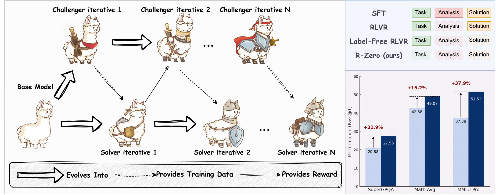

# *R-Zero*: Self-Evolving Reasoning LLM from Zero Data

> Teach Large Language Models to reason and evolve on their own, starting with nothing but a base model. No data required.

Check  out our [paper](https://arxiv.org/abs/2508.05004) or [webpage](https://chengsong-huang.github.io/R-Zero.github.io/)  for the details

## 🔥 Updates

<!-- - [2025-8-12] Update codes to make training more smooth. -->

- [2025-8-8] R-Zero got `#2 Paper of the day` in [huggingface daily paper](https://huggingface.co/papers/2508.05004).

- [2025-8-7] We released our [paper](https://arxiv.org/abs/2508.05004) and code.


## 🏴󠁶󠁵󠁭󠁡󠁰󠁿 Overview



Training powerful reasoning models traditionally requires massive, human-curated datasets, which are expensive and hard to scale. [**R-Zero**](https://arxiv.org/abs/2508.05004) is a novel framework that enables LLMs to improve their reasoning abilities autonomously, without needing *any* pre-existing tasks or labels. It's a truly self-evolving system that learns from scratch.

At its core, R-Zero sets up a dynamic co-evolutionary loop between two instances of the same base model:

1.  **The Challenger 🎯:** Its job is to probe the Solver for weaknesses and generate challenging problems that are right at the edge of its capabilities.
2.  **The Solver 🧠:** Its goal is to continuously improve by solving the increasingly difficult tasks posed by the Challenger.

This process creates a perfectly tailored, adaptive curriculum. The Challenger learns to ask better questions, and the Solver learns to find better answers. The entire cycle is self-contained, using techniques like majority voting for pseudo-labels and relative policy optimization to guide the learning.

### Key Features
* **Fully Autonomous:** Starts from zero external data. No need for pre-existing problem sets or human-annotated solutions.
* **Co-Evolutionary Loop:** A unique Challenger-Solver dynamic creates a targeted, adaptive curriculum for continuous improvement.
* **Proven Performance:** Delivers significant performance boosts on several reasoning benchmarks.
* **Strong Generalization:** Reasoning skills learned on specific domains (like math) successfully transfer to general reasoning tasks.
* **Model-Agnostic:** Consistently improves the performance of various backbone LLMs.

---

## ⚡️ Quickstart Guide

Getting started is easy! Just follow these steps.
### 1. Configure Environment and Prepare Dirs
```bash
git clone https://github.com/Chengsong-Huang/R-Zero.git

# Navigate into the new directory
cd R-Zero
# Install the required packages
pip install -r requirements.txt
# Set an environment variable for your storage path.
# This is a large directory where checkpoints and generated data will be saved.
export STORAGE_PATH="/path/to/your/storage"
export HUGGINGFACENAME="yourhuggingfacename"

mkdir -p \
  "$STORAGE_PATH/evaluation" \
  "$STORAGE_PATH/models" \
  "$STORAGE_PATH/generated_question" \
  "$STORAGE_PATH/temp_results"
```
### 2. Add API Keys

You'll need to add a few API keys to run the experiments:

* In `tokens.json`, add your API keys for **Hugging Face** and **WandB** (for logging).
* In `evaluation/results_recheck.py`, add your **OpenAI GPT** API key for evaluation.

### 3. Run the Experiments!

You can replicate all of our experimental results with a single script.

```bash
# The script takes the base model name and an abbreviation as arguments
# The abbreviation is used for creating a directory to save the model.
# Format: bash scripts/main.sh [Base_Model_Name] [Abbreviation]

# Example using Qwen/Qwen3-4B-Base:
bash scripts/main.sh Qwen/Qwen3-4B-Base qwen3-4b
```

## 📊 Impressive Results

The table below compares the performance of the Base Model, a Zero-Shot Challenger baseline, and our iterative R-Zero framework. Peak performance for each model is highlighted in **bold**.

| Model Name | Overall AVG | MATH AVG | SuperGPQA | MMLU-Pro | BBEH |
|:---|:---:|:---:|:---:|:---:|:---:|
| ***Qwen3-4B-Base*** | | | | | |
| &emsp;Base Model | 27.10 | 42.58 | 20.88 | 37.38 | 7.57 |
| &emsp;Base Challenger | 30.83 | 44.36 | 24.77 | 47.59 | 6.59 |
| &emsp;R-Zero (Iter 1) | 34.27 | 48.06 | **27.92** | 51.69 | 9.42 |
| &emsp;R-Zero (Iter 2) | **34.92** | 48.44 | 27.72 | **53.75** | 9.76 |
| &emsp;R-Zero (Iter 3) | 34.64 | **49.07** | 27.55 | 51.53 | **10.42** |
| ***Qwen3-8B-Base*** | | | | | |
| &emsp;Base Model | 34.49 | 49.18 | 28.33 | 51.80 | 8.63 |
| &emsp;Base Challenger | 36.43 | 51.87 | 30.12 | 54.14 | 9.60 |
| &emsp;R-Zero (Iter 1) | 37.93 | 53.39 | 31.26 | 57.17 | 9.91 |
| &emsp;R-Zero (Iter 2) | 38.45 | 53.84 | **31.58** | 58.20 | 10.20 |
| &emsp;R-Zero (Iter 3) | **38.73** | **54.69** | 31.38 | **58.23** | **10.60** |
| ***OctoThinker-3B*** | | | | | |
| &emsp;Base Model | 12.27 | 26.64 | 10.09 | 10.87 | 1.46 |
| &emsp;Base Challenger | 14.41 | 27.51 | 11.19 | 14.53 | **4.40** |
| &emsp;R-Zero (Iter 1) | 14.93 | 27.76 | 12.21 | 15.72 | 4.05 |
| &emsp;R-Zero (Iter 2) | 15.11 | 28.20 | 12.43 | 16.08 | 3.74 |
| &emsp;R-Zero (Iter 3) | **15.67** | **29.32** | **12.44** | **16.71** | 4.20 |
| ***OctoThinker-8B*** | | | | | |
| &emsp;Base Model | 16.81 | 32.11 | 13.26 | 20.21 | 1.64 |
| &emsp;Base Challenger | 25.08 | 36.41 | 16.99 | 41.46 | 5.46 |
| &emsp;R-Zero (Iter 1) | 26.44 | 37.80 | 19.15 | **42.05** | 6.77 |
| &emsp;R-Zero (Iter 2) | 26.77 | 38.23 | 19.27 | 41.34 | **8.25** |
| &emsp;R-Zero (Iter 3) | **26.88** | **38.52** | **19.82** | 40.92 | **8.25** |

## ❓ FAQ for Developer

### **Q: What is the hardware setup for the experiments?**

**A:** All our experiments were conducted on an 8-GPU server, using models that can run on a single GPU (e.g., 4B or 8B). If you need to run experiments under different conditions, such as with larger models or different hardware, you will need to modify the code accordingly.


### **Q: What should I do if I encounter environment configuration issues during installation?**

**A:** Our framework's structure is inspired by [EasyR1](https://github.com/hiyouga/EasyR1/tree/main). If you run into any environment-related issues, we highly recommend checking out their setup instructions or using their Docker environment as a reference.

### **Q: Where are the training logs and model checkpoints saved?**

**A:** All generated data, including logs, datasets, and model checkpoints, will be saved in the directory you set via the `STORAGE_PATH` environment variable. Also dataset will be sent to huggingface via `HUGGINGFACENAME`.

### **Q: What if the code gets stuck during the questioner training process?**

**A:** This is likely due to a strange bug in the `math_verify` lib, which can cause an infinite loop when processing certain answers. We've added a timeout control to mitigate this, but it may not catch all cases. If you encounter this issue, please just restart the training from the last saved checkpoint.
>> I suddenly find there is a lib named `timeout_decorator` which can solve this problem after I complete most of the experiments...... (not sure whether it will introduce new problems.)


## 🙏 Acknowledgements

Our framework is directly based on the great work of [**EasyR1**](https://github.com/hiyouga/EasyR1/tree/main), implementing all of its core functionalities. Additionally, our evaluation process referenced the work from [**General-Reasoner**](https://github.com/TIGER-AI-Lab/General-Reasoner). We are very grateful for their excellent work.

## 💬 Citation
If our work is useful for you, please consider citing our paper:
```
@article{huang2025rzeroselfevolvingreasoningllm,
      title={R-Zero: Self-Evolving Reasoning LLM from Zero Data}, 
      author={Chengsong Huang and Wenhao Yu and Xiaoyang Wang and Hongming Zhang and Zongxia Li and Ruosen Li and Jiaxin Huang and Haitao Mi and Dong Yu},
      year={2025},
      eprint={2508.05004},
      archivePrefix={arXiv},
      primaryClass={cs.LG},
      url={https://arxiv.org/abs/2508.05004}, 
}
```

## Star History

[](https://star-history.com/#Chengsong-Huang/R-Zero&Date)
